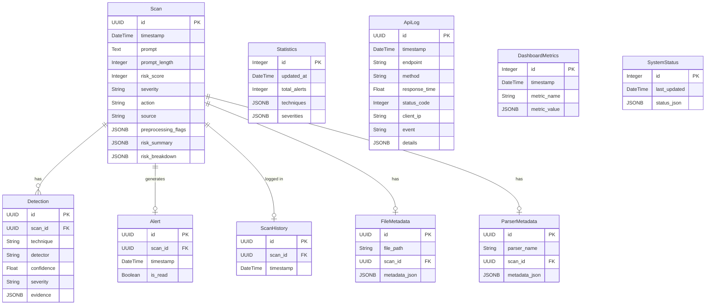

# PromptSentinel Database Architecture

## Relational Models

## Description
The architecture uses a star-like pattern around the `Scan` entity, which is the core domain model representing a processed prompt. `Detection`, `Alert`, and `FileMetadata` all use foreign keys with cascading deletes mapped to the `Scan.id` primary key.

`Statistics`, `DashboardMetrics`, `SystemStatus`, and `ApiLog` are standalone operational tables used for aggregations and tracking metrics without bloating the primary operational logic.
